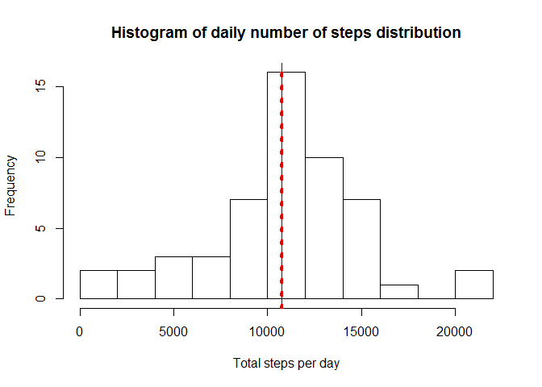
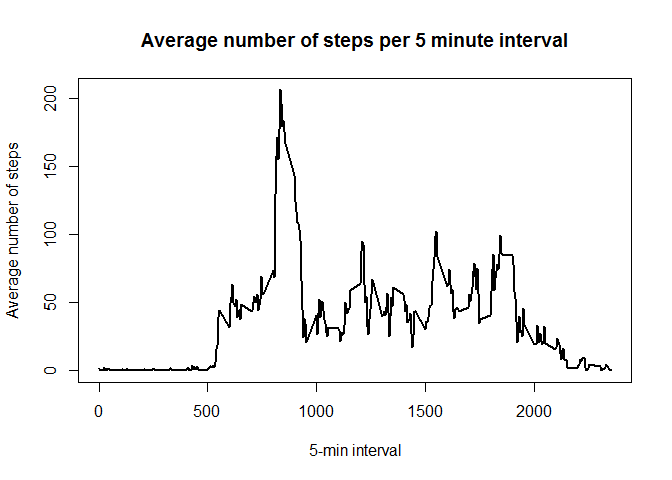
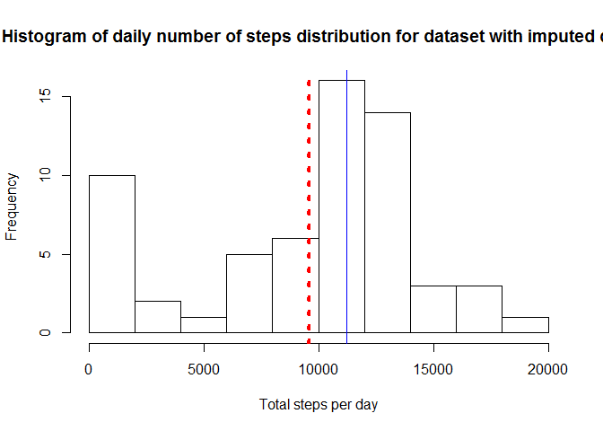
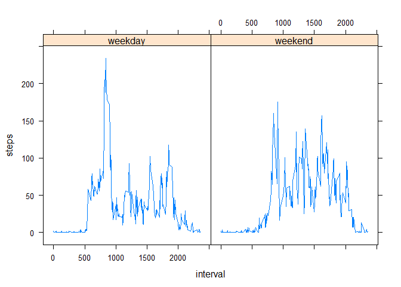

# Reproducible Research: Peer Assessment 1


## Loading and preprocessing the data

```r
activity <- read.csv('activity.csv')
activity$date <- as.Date(activity$date)
```

## What is mean total number of steps taken per day?
Calculating total sum of steps for each day:  

```r
activity_per_day <- aggregate(steps ~ date, data = activity, sum)
```
Plotting histogram of daily number of steps distribution:  

```r
hist(activity_per_day$steps, breaks = 10, xlab = 'Total steps per day', main = 'Histogram of daily number of steps distribution')
# drawing lines for data mean and median
abline(v = mean(activity_per_day$steps), col = 'red', lwd = 4, lty = 3)
abline(v = median(activity_per_day$steps), col = 'blue', lwd = 1)
```

 
  
The mean and median of total number of steps per day are almost equal, according to histogram.  
Mean is:  

```r
mean(activity_per_day$steps)
```

```
## [1] 10766.19
```
Median is:  

```r
median(activity_per_day$steps)
```

```
## [1] 10765
```
## What is the average daily activity pattern?
First, we need to calculate average number of steps taken within each 5-minute interval:  

```r
avg_steps_per_5min <- aggregate(steps ~ interval, data = activity, mean)
```
Plot of those average values:  

```r
plot(avg_steps_per_5min$interval, avg_steps_per_5min$steps, xlab = '5-min interval', ylab = 'Average number of steps', main = 'Average number of steps per 5 minute interval', type = 'l', lwd = 2)
```

 
  
Maximum average number of steps is:  

```r
max(avg_steps_per_5min$steps)
```

```
## [1] 206.1698
```
Interval of maximum average number of steps is:  

```r
avg_steps_per_5min$interval[which.max(avg_steps_per_5min$steps)]
```

```
## [1] 835
```
## Imputing missing values
Total number of missing value:  

```r
sum(is.na(activity$steps))
```

```
## [1] 2304
```
Filling missing values with mean value of appropriate 5-min interval, calculating new daily totals:  

```r
is_missing <- is.na(activity$steps)
activity_filled <- merge(activity, avg_steps_per_5min,  by = 'interval')
activity_filled[is_missing, 'steps.x'] <- activity_filled[is_missing, 'steps.y']
activity_filled$steps.y <- NULL
names(activity_filled)[2] <- 'steps'
activity_per_day_filled <- aggregate(steps ~ date, data = activity_filled, sum)
```
Plotting histogram of new dataset:  

```r
hist(activity_per_day_filled$steps, breaks = 10, xlab = 'Total steps per day', main = 'Histogram of daily number of steps distribution for dataset with imputed data')
# drawing lines for data mean and median
abline(v = mean(activity_per_day_filled$steps), col = 'red', lwd = 4, lty = 3)
abline(v = median(activity_per_day_filled$steps), col = 'blue', lwd = 1)
```

 
  
For this new dataset, mean is less than median.  
Mean is:  

```r
mean(activity_per_day_filled$steps)
```

```
## [1] 9563.93
```
Median is:  

```r
median(activity_per_day_filled$steps)
```

```
## [1] 11215.68
```
## Are there differences in activity patterns between weekdays and weekends?
Assigning new factor variable to dataset, indicating weekday or weekend type of observations, calculating mean number of steps per 5min intervals, aggregated by weekday/weekend factor:  

```r
library(lubridate)
activity_filled$weekdays <- wday(activity_filled$date, label = TRUE)
activity_filled$weekday_weekend <- NA
activity_filled[activity_filled$weekdays %in% c('Sat', 'Sun'), 'weekday_weekend'] <- 'weekend'
activity_filled[is.na(activity_filled$weekday_weekend), 'weekday_weekend'] <- 'weekday'
activity_per_5min_wdays <- aggregate(steps ~ weekday_weekend + interval, data = activity_filled, mean)
activity_per_5min_wdays$weekday_weekend <- as.factor(activity_per_5min_wdays$weekday_weekend)
```
Panel plot of mean activity per 5 minute intervals on weekdays and weekends:  

```r
library(lattice)
xyplot(steps ~ interval | weekday_weekend, activity_per_5min_wdays, type='l')
```

 
  
As you can see, average number of steps per 5 minute intervals mostly higher on weekdays.  
